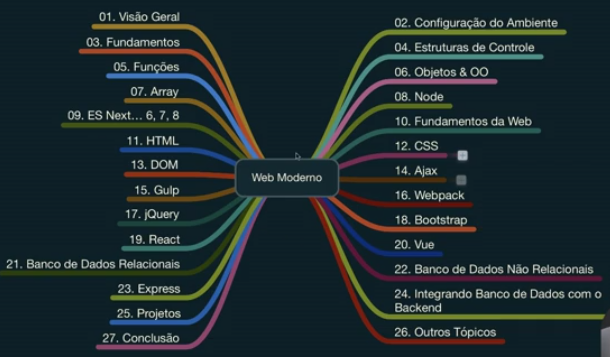

# JavaScript Moderno(2020)

[](https://travis-ci.org/verekia/js-stack-from-scratch)
[](https://github.com/verekia/js-stack-from-scratch/releases)
[](https://david-dm.org/verekia/js-stack-boilerplate)
[](https://david-dm.org/verekia/js-stack-boilerplate?type=dev)
[](https://gitter.im/js-stack-from-scratch/)

[](https://facebook.github.io/react/)
[](http://redux.js.org/)
[](https://github.com/ReactTraining/react-router)
[](https://flowtype.org/)
[](http://eslint.org/)
[](https://facebook.github.io/jest/)
[](https://yarnpkg.com/)
[](https://webpack.github.io/)
[](http://getbootstrap.com/)

---
 Curso Web 13 cursos - Javascript React Vue JS Node HTML CSS jQuery Bootstrap 4 Webpack Gulp Banco de Dados e muito mais:

 <https://www.udemy.com/course/curso-de-javascript-moderno-do-basico-ao-avancado/>
 
---


### Algoritmo para validar CPF (ES6)
---
````
class ValidadeCPF {
    constructor(cpf) {
        Object.defineProperty(this, 'cleanCPF', {
            writable: false, //Não pode escrever
            enumerable: true, //True: irá aparecer no console.log
            configurable: false,
            value: cpf.replace(/\D+/g, '')
        });
    }

    partialCPF() {
        return this.cleanCPF.slice(0, -2);
    }

    isSequenceValid() {
        const sequence = this.cleanCPF.charAt(0).repeat(11);
        return this.cleanCPF === sequence; 
    }

    initialValidade() {
        if(!this.cleanCPF) return false;
        if(this.cleanCPF.length !== 11) return false;
        if(this.cleanCPF === 'undefined') return false;
        if(typeof this.cleanCPF !== 'string') return false;
    }

    validade() {
        this.initialValidade();
        if(this.isSequenceValid()) return false;
        const partialCPF = this.partialCPF();
        const firstDigit = ValidadeCPF.getDigit(partialCPF);
        const secondDigit = ValidadeCPF.getDigit(partialCPF + firstDigit);
        const newCPF = partialCPF + firstDigit + secondDigit;

        return newCPF === this.cleanCPF;
    }

    //Método Static pois não precisa de nada da instancia, tudo é passado como parametro
    static getDigit(partialCPF){
        let sumDigit = 0;
        let countdown = partialCPF.length + 1;
        for(let strNumeric of partialCPF){
            sumDigit += (countdown * parseInt(strNumeric))
            countdown--;
        }

        const digit = 11 - (sumDigit % 11);
        return digit > 9 ? '0' : String(digit);
    }
}

const CPF = '111.111.111-11'; 
//const CPF = '185.844.856-76';
//const CPF = '705.484.450-52'; 
//const CPF = '076.392.316-80';
let cpf = new ValidadeCPF(CPF);
if(cpf.validade())
    console.log(`O CPF ${CPF} é válido.`);
else
    console.log(`O CPF ${CPF} é inválido.`);
````

### Algoritmo para gerar senhas (ES6)
---

````
const rand = (min, max) => Math.floor(Math.random() * (max - min) + min);
const generateUpperChar = () => String.fromCharCode(rand(65, 91));
const generateLowerChar = () => String.fromCharCode(rand(97, 123));
const generateNumber = () => String.fromCharCode(rand(48, 58));
const symbols = ',.;~^[]{}!@#$%¨&*()_+=-/\/?:><}º`´|ª§¬¢£³²¹"°';
const generateSymbol = () => symbols[rand(0, symbols.length)];

export default function generatePassword(qtdeChar = 5, upperChar, lowerChar, numbers, symbols) {
    const pwdArray = [];
    qtdeChar = Number(qtdeChar);

    for(let i = 0; i < qtdeChar; i++){
        upperChar && pwdArray.push(generateUpperChar());
        lowerChar && pwdArray.push(generateLowerChar());
        numbers && pwdArray.push(generateNumber());
        symbols && pwdArray.push(generateSymbol());
    }

    return pwdArray.join('').slice(0, qtdeChar);
}
````

### Aplicações de Exemplo (ES6)
---
 
 - Gerador de CPF: http://gerador-cpf-proglima.surge.sh/
 - Gerador de Senha: http://gerador-senha-proglima.surge.sh/

### Links Úteis de Estudo
---
 - https://developer.mozilla.org/pt-BR/docs/Web/JavaScript - Documentação do JavaScript <br>
 - https://rocketseat.com.br/starter/curso-gratuito-javascript - Curso Gratuito de JavaScript <br>
 - https://rocketseat.com.br/starter/curso-gratuito-javascript-es6 - Curso Gratuito de ES6+ (JS Moderno) <br>
 - https://rocketseat.com.br/starter/curso-gratuito-nodejs - Curso Gratuito de NodeJS <br>
 - https://rocketseat.com.br/starter/curso-gratuito-react-native - Curso Gratuito de React-Native <br>
 - https://www.youtube.com/watch?v=9w3o9NHXqu0&list=PLMdYygf53DP5Sc6yFYs6ZmjsuuA2fu0TK - Código Limpo em JavaScript <br>
 - https://medium.com/@matheusml/o-guia-do-es6-tudo-que-voc%C3%AA-precisa-saber-8c287876325f - JS Antigo x JS Moderno <br>
 - http://www.enrique7mc.com/2016/05/lista-apis-publicas/ - Lista de APIs Públicas <br>
 - https://rocketseat.com.br/starter/curso-gratuito-reactjs - Curso Gratuito de ReactJS <br>
